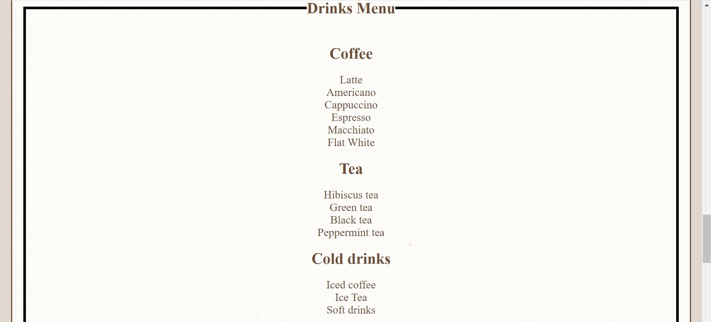

# Seedlings Coffee Van

We are passionate about providing the best possible experience whatever your event may be and have a wealth of experience organising events within the corporate & consumer world.
We are constantly creating new ideas, always staying ahead of the game and we're only too happy to sit down with you and produce something out of this world!
You can rent us for weddings, parties, markets, festivals, corporate events, sampling, any special occasion, promotional, advertising needs, TV/media appearances, anything you can think of really!
Simply share your dreams with us and let us make them a reality! The sky's the limit!

## Features

### Existing Features

- __The Heading and Nav__

  - Featured at the top of the page, the heading is easy to see for the user. Upon viewing the page, the user will be able to see the name of the respective section he might want to navigate to and click "it" to navigate to another page or section in the same page.

- __The What We Do Area__

  - This section will allow the user to get information about our oal as a company and be aware of the services we have available for market.
  - The user will be able to select the product of his interest and learn how we can personalize it.

- __The Curiosities section__

  - In the curiosity section, the user will be introduced to the legend of the first human experience with coffee and how it affected the human behavior.

- __The Menu Area__

  - This section will allow the user to see exactly how many options we have in our menu.

- __The Contact Us Area__

  - This section will allow the user to get in contact with us, just by filling a simple form and submiting it.

- __The Footer Area__

  - This section will allow the user to click on the links and be redirected to our social media pages.

- __The Events Gallery Area__

  - This section will allow the user to see photos of previous events and have an idea of how is the outcome of our work..

### Features Left to Implement

- Booking system would be a good feature to be added.
- Overall, I would revise the spacing and padding of the site's text. The text could be better centered and spread on larger screens to improve readability for the user.

## Structure

- The main structure of this website involves 2 pages, the Home page(which is divided in 4 sections, What We Do, Curiosities, Menu, Contact Us) and the Events Gallery page.

- The pages will all include the same heading and footer.

- The header of each page is the same with nav bars.

- The footer of each page is the same with links to social medias.

## Target Audience

Men and women who are looking to take their event/ special ocasion to another level of experience using our Coffee Van. They will be aged between 30-50, earning well and looking for something special.

## Strategy

My goal of this site is to create a simple, visually appealing website to help customers personalize their events with a nice vintage touch and with excellet services.

## Testing

Manual tests were conducted throughout the creation of this site.
Responsivenes was tested and the game runs in different screen sizes.
I have also tested the website using

- HTML Validator
- CSS Validator
- Tested with Chrome DevTools

### Validator Testing

- HTML
  - HTML Validator: Document checking on [FreeFormatter.com](https://www.freeformatter.com/html-validator.html).

- CSS
  - W3C CSS Validator: The [W3C Validator](https://jigsaw.w3.org/css-validator/validator)

### Unfixed Bugs

No bugs remaining.

## Deployment

Deployment To GitHub Pages:

- I logged into [GitHub](https://github.com/)
- In my account on the GitHub website, I selected Repositories
- I selected the Luciano2712/Coffee-Van-Project-Milestone-1 from the GitHub Dashboard.
- I navigated to Settings and to the GitHub Pages section.
- From the Source section, I clicked on the drop-down menu and selected Master Branch.
- Once Master Branch is selected, the page has been automatically refreshed, with a detailed ribbon display GitHub Source Saved Pages indicating the successful implementation.

The live link can be found here - <https://luciano2712.github.io/Coffee-Van-Project-Milestone-1/>

## Credits

- To create this website, I relied heavily on the material covered in the Full Stack Development course by Code Institute. I also used W3Schools Online Web Tutorials. I learnt the course material but did have to refer to additional YouTube videos to get a better understanding.

### Content

- The text for the feed was sourced from wikipedia.
- Images for the README are screenshots of the deployed project.
- Images downloaded from [Google images](https://www.google.ie/)
- The icons in the footer were taken from [Font Awesome](https://fontawesome.com/)

### Media

- All images were sourced from other sites using google images.
- Youtube video can be loaded.
- The icons used for the footer were taken from [Font Awesome](https://fontawesome.com/icons?d=gallery)
- The font used was taken from [Google Fonts](https://fonts.google.com/specimen/Playfair+Display)
